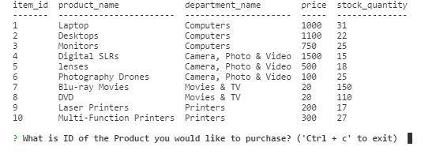
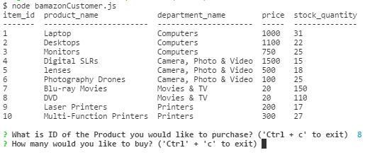
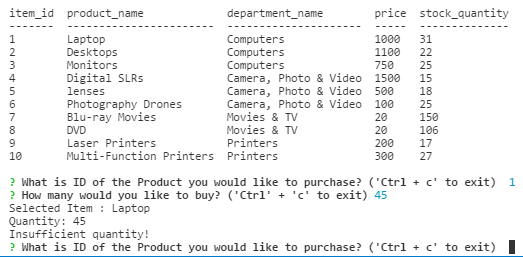
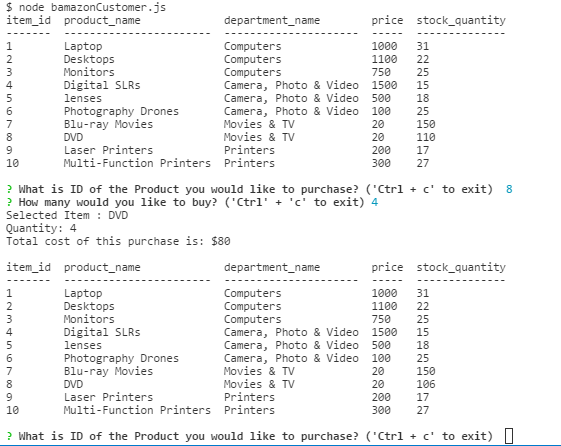

# Bamazon

 The app takes in orders from customers and depletes stock from the store's inventory.

 The app should then prompt users with two messages.
 - The first asks them the ID of the product they would like to buy.

 
 
 - The second message asks how many units of the product they would like to buy.

 

 Once the customer has placed the order, this application checks if this "store" has enough of the product to meet the customer's request.
 If not, the app logs a phrase "Insufficient quantity!", and then prevents the order from going through.

 

 If the "store" does have enough of the product, it fulfills the customer's order by:
 - updating the SQL database to reflect the remaining quantity.
 - showing the customer the total cost of their purchase.

  